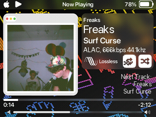
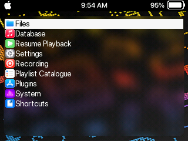
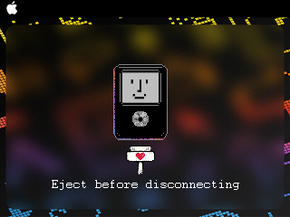
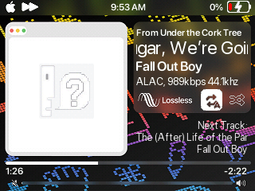

# Rainbow Macintosh Icons 

Version 1.1

Last Update: 26 November 2025

Updated to correct hold and lock icon locations, changed which viewers correspond to what directory. Removed unneccessary background.

License: CC-BY-SA 3.0
By: Monica G

Description: My first theme, based on the macOS Sequoia Susan Kare wallpaper, and it attempts to mimic the liquid glass effect seen in macOS Tahoe/iOS 26. 

Code based on: iPod reFresh by Ciprian Dragu (based on FreshOS by c-yu (yuuiko)) and SNARTY by Simon Anden (based on SNAZZY by Phil Graves, based on SPAZZ by Chuck Largo)
Icon elements altered from: iPod reFresh by Ciprian Dragu and win95 by Vera B
Heavily inspired by macOS Sequoia and iOS 26 by Apple Inc.

Background Graphic: RainbowDynamicMac by BasicAppleGuy https://basicappleguy.com/haberdashery/macintoshwallpapers (10 June 2024)

## wps screenshot 1

## menu screenshot

## usb screen screenshot

## wps screenshot 2
